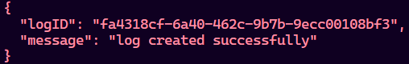

# Logging Middleware

A reusable logging middleware for Node.js/Express applications that sends structured logs to a remote evaluation server. This middleware helps capture the full lifecycle of significant events, including errors, warnings, info, and debug messages.

## Features
- Sends logs to a remote API with stack, level, package, and message fields
- Validates allowed values for stack, level, and package
- Easy integration with any backend Node.js/Express project
- Uses environment variables for secure API key management

## Getting Started

### Prerequisites
- Node.js (v14+ recommended)
- npm

### Installation
1. Clone this repository or copy the middleware files into your project.
2. Install dependencies:
   ```sh
   npm install
   ```

### Environment Setup
Create a `.env` file in the root directory with your API key:
```
LOGGING_API_KEY=your_access_token_here
```

### Usage
Import and use the `Log` function in your application:

```js
import Log from "./middleware/logging.js";

// Example usage
await Log("backend", "info", "route", "Demo endpoint hit successfully");
```

## API Details
- **Endpoint:** `POST http://20.244.56.144/evaluation-service/logs`
- **Headers:**
  - `Authorization: Bearer <LOGGING_API_KEY>`
  - `Content-Type: application/json`
- **Body:**
  ```json
  {
    "stack": "backend",
    "level": "info",
    "package": "route",
    "message": "Demo endpoint hit successfully"
  }
  ```
- **Success Response:**
  
